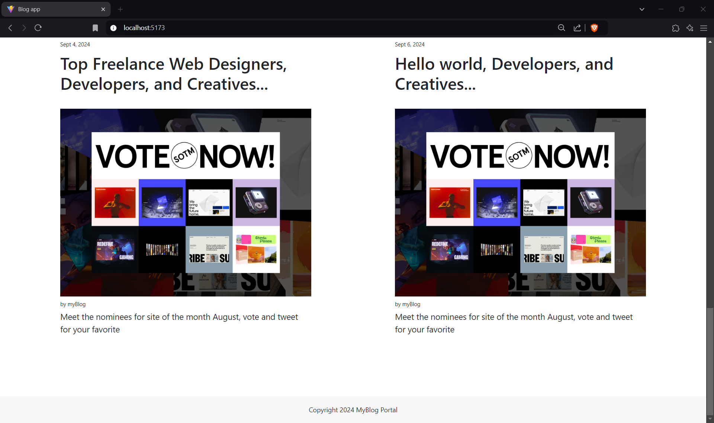

<h1>BookMyHotel</h1>

Hotel booking website developed using ViteJs.

<h1>Tools Used</h1>
<ul>
  <li>ViteJs</li>
  <li>React Lazy Loading</li>
  <li>ChakraUI</li>
  <li>JWT Web Token</li>
  <li>Bcrypt Hashing</li>
  <li>NodeJs</li>
  <li>ExpressJs</li>
  <li>MongoDB</li>
  <li>Multer</li>
  <li>React Routing</li>
  <li>User Context</li>
  <li>Axios</li>
</ul>

<h1>Future updates</h1>
<ul>
  <li>Admin Dashboard</li>
</ul>

<h1>Screenshots</h1>
<h3>Homepage</h3>

 
<h3>Registration Page</h3>
 

 
<h3>Login Page</h3>
 

 
<h3>Homepage after Logging in</h3>
 

 
<h3>Product Page</h3>
 

<h3>Listing Page</h3>

